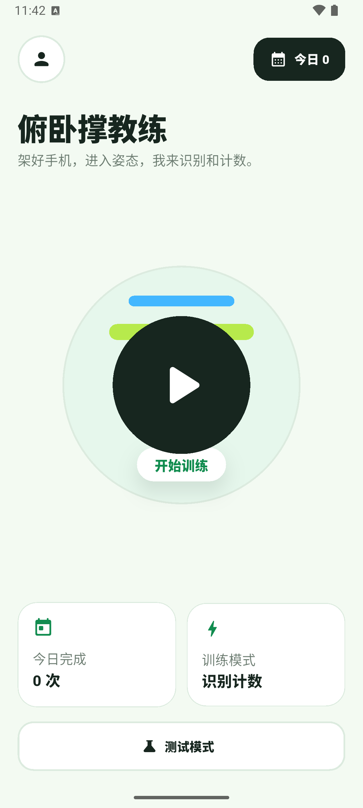
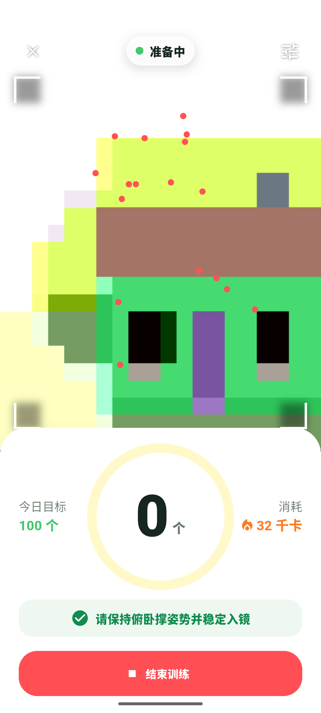
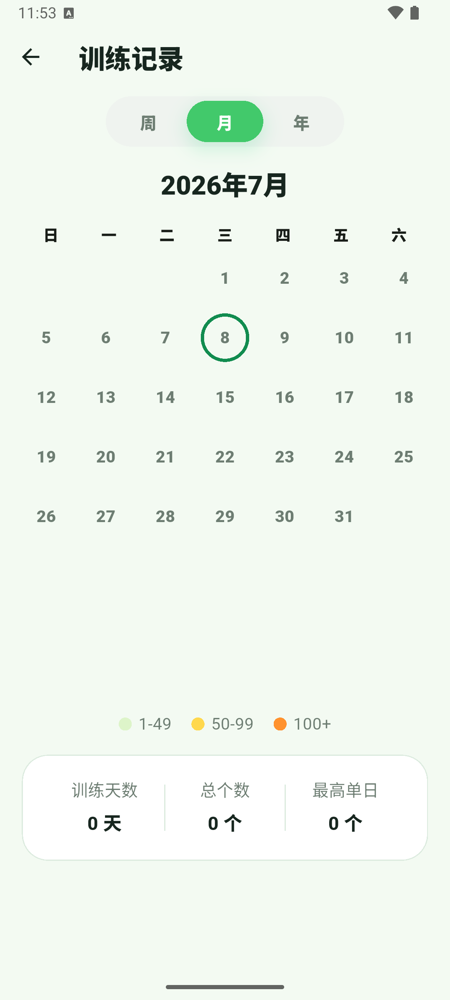

# App UI V1 设计维护文档

日期：2026-07-08  
范围：首页、训练页、记录页、个人占位页、多语言与浅深色主题基础能力。测试模式只保留开发可用，不纳入 V1 视觉统一范围。

## 1. 设计定位

V1 的目标不是做完整品牌系统，而是把工程 Demo 包装成一个能继续迭代的产品地基。

核心原则：
- 普通用户打开 App 后，第一眼知道这是“俯卧撑训练与计数”产品。
- 训练时最重要的信息是当前个数，个数必须比状态文案、按钮、装饰都更突出。
- 记录页要让用户一眼看出哪些天训练过、训练量大概多少。
- 保留多邻国式的友好、圆润、明亮，但不做吉祥物，不复制多邻国具体品牌元素。
- 不为了美术效果牺牲识别功能。相机画面、骨架点、结束按钮必须稳定可用。

## 2. 当前参考截图

首页：



训练页：



记录页：



## 3. 视觉方向

当前采用混合方案：
- 首页沿用 A 方向：成熟、明亮、友好，中央圆形启动入口。
- 训练页采用 B 方向：上方相机识别画面，下方大号计数圆环，突出当前个数。
- 记录页采用 B 方向：周/月/年胶囊、圆点热力日历、月统计卡。

这次没有引入图片素材或新依赖。所有视觉都由 Flutter 原生组件、颜色、圆角、边框和阴影实现，后续维护成本最低。

## 4. 颜色规则

颜色常量定义在 [lib/ui/app_theme.dart](../../lib/ui/app_theme.dart)，页面直接 import 使用，不建私有副本：

```dart
const ink = Color(0xFF17261F);
const muted = Color(0xFF6D7D72);
const canvas = Color(0xFFF3FAF2);
const panel = Color(0xFFFFFFFF);
const line = Color(0xFFDCEBDF);
const green = Color(0xFF42C96B);
const greenDark = Color(0xFF118C4F);
const lime = Color(0xFFB7EA4C);
const sky = Color(0xFF43B7FF);
const coral = Color(0xFFFF4F55);
const yellow = Color(0xFFFFD84D);

const darkInk = Color(0xFFE7F3EA);
const darkMuted = Color(0xFF9EB3A6);
const darkCanvas = Color(0xFF0E1713);
const darkPanel = Color(0xFF17241D);
const darkLine = Color(0xFF2B4034);
```

使用约定：
- `canvas` / `darkCanvas`：App 全局背景。
- `panel` / `darkPanel`：内容面板。
- `ink` / `darkInk`：主文字、深色按钮、深色面板。
- `muted` / `darkMuted`：说明文字、弱信息。
- `line` / `darkLine`：边框。
- `green` / `greenDark`：主行动、训练状态、热力低强度。
- `coral`：结束训练按钮，只用于危险/停止操作。
- `yellow` / 橙色：记录页热力中高强度。

浅深色主题由 `appTheme(brightness: ...)` 统一生成，App 根使用 `ThemeMode.system` 跟随系统。页面优先使用 `Theme.of(context).colorScheme` / `textTheme`，只有产品识别色、热力色、相机舞台色这类固定语义才直接用 palette 常量。

不要把紫色渐变、深蓝科技风、黑金健身房风引进 V1。它们会破坏当前方向。

## 5. 页面规则

### 5.1 首页

入口文件：[lib/ui/pages/home_page.dart](../../lib/ui/pages/home_page.dart)

结构：
- 顶部左侧：个人入口 `_RoundIconButton`。
- 顶部右侧：今日计数 `_TodayButton`。
- 中部：训练卡 `_ExerciseCard`，包含识别卖点、目标、标题、说明和开始训练按钮。
- 底部：测试模式按钮。

维护规则：
- 首页只负责“开始训练”和“进入记录/个人/测试模式”，不要塞训练详情。
- 训练卡里的开始训练按钮必须保持最大触控目标。
- 测试模式按钮可以弱化，但不能隐藏；它是开发验证入口。

### 5.2 训练页

入口文件：[lib/ui/pages/workout_page.dart](../../lib/ui/pages/workout_page.dart)

结构：
- 上方：圆角相机画面。
- 相机画面左上：关闭按钮 `_CameraBackButton`。
- 相机画面顶部居中：准备状态 `_WorkoutChip`。
- 下方：大计数面板 `_WorkoutCountPanel`。
- 底部：红色结束训练按钮。

关键设计决策：
- 当前个数是训练页第一优先级，因此放在大圆环中，字体最大。
- 相机画面是识别舞台，不再承担主要信息展示。
- 状态文案只放在计数面板底部，避免抢数字视觉权重。
- 结束训练按钮固定在底部，颜色使用 `coral`。

维护规则：
- 不要把计数重新放回 AppBar 或小角标。
- 不要让状态文案比数字更醒目。
- 不要移除骨架点叠加，第一版需要给用户和开发者确认识别状态。
- 停止训练相关生命周期逻辑不能为 UI 改动让路，尤其是等待当前帧推理结束后再释放模型。

相关安全逻辑：
- `WorkoutController.stop()` 负责停止硬件、等待当前帧推理结束后再释放模型。
- 页面 `_onStopPressed()` 负责本地存储与导航；保存失败时保留 pending session，允许重试。

### 5.3 记录页

入口文件：[lib/ui/pages/records_page.dart](../../lib/ui/pages/records_page.dart)

结构：
- 顶部：标题“训练记录”。
- 中部：周/月/年胶囊 `_CalendarModePill`，当前只实现月视图。
- 主体：圆点热力日历 `_RecordDayCell`。
- 底部：热力图例 `_CalendarLegend` 和月统计 `_MonthSummaryCard`。

热力规则：
- `0`：不显示色块，只显示日期。
- `1-49`：浅绿色圆点。
- `50-99`：黄色圆点。
- `100+`：橙色圆点。
- 今天用绿色深色描边强调。

维护规则：
- 当前只有月视图，周/年胶囊是视觉预留，不要加假交互。
- 后续真做周/年视图时，再接入真实路由或状态，不要只做按钮样子。
- 如果日历高度在小屏溢出，优先调整日历高度和间距，不要缩小日期数字到难读。

### 5.4 个人页（会员系统）

入口文件：[lib/ui/pages/profile_page.dart](../../lib/ui/pages/profile_page.dart)

**注意**：原 V1 此处为占位页，现已接入会员系统（见 [docs/modules/membership.md](../modules/membership.md)）。当前能力：
- 未登录：显示 Google 登录。
- 已登录非会员：显示开通会员、恢复购买、退出登录。
- 已登录会员：显示会员已开通，隐藏重复开通按钮，保留恢复购买。
- 自定义 UGK Premium 底部弹窗。

维护规则：
- 会员登录/购买/恢复/退出逻辑由 `AccountController` 编排，页面只做渲染和导航。
- 错误卡与会员卡已改为主题感知色（浅/深色）。
- 会员态展示、凭证注入规则见 `docs/modules/membership.md`，不在本 UI 文档重复。

### 5.5 测试模式

入口文件：[lib/ui/pages/test_mode_page.dart](../../lib/ui/pages/test_mode_page.dart)

保留内容：
- `OfflineReplayTab`
- `LiveCameraTab`

维护规则：
- 测试模式是开发工具，不要求和产品页完全统一。
- 不要为了美化测试模式改动计数算法或回放流程。

## 6. 组件边界

当前 UI helper 跟随页面就近放在 `lib/ui/pages/` 对应文件内，这是刻意的 V1 简化。

原因：
- 组件只被一个页面使用。
- 过早拆文件会增加维护成本。

可以保持在页面文件内的组件：
- `_RoundIconButton`
- `_TodayButton`
- `_ExerciseCard`
- `_HeroBadge`
- `_CalendarModePill`
- `_RecordDayCell`
- `_CalendarLegend`
- `_MonthSummaryCard`
- `_WorkoutChip`
- `_WorkoutCountPanel`
- `_CameraBackButton`

未来满足以下条件再拆到 `lib/ui/widgets/`：
- 同一组件被 2 个以上页面复用。
- 页面文件因 UI helper 继续增长到难以审查。
- 需要为产品组件单独加 widget test。

## 7. 多语言与主题

多语言入口：
- `l10n.yaml`
- `lib/l10n/app_zh.arb`
- `lib/l10n/app_en.arb`
- `lib/l10n/app_localizations*.dart`（由 `flutter gen-l10n` 生成）

维护规则：
- 新增用户可见文案时，优先加到 ARB，再通过 `AppLocalizations.of(context)` 使用。
- 当前支持 `zh` / `en`，`preferred-supported-locales` 保持中文优先。
- 语音资源仍是中文播报，和 UI 文案本地化分开管理。
- 不在 domain/product/control 层引用 l10n；本地化只属于 UI/app 根。

主题入口：
- `lib/main.dart` 注册 `theme`、`darkTheme`、`themeMode: ThemeMode.system`。
- `lib/ui/app_theme.dart` 产出浅/深两套 `ThemeData`。

维护规则：
- 纯页面/组件优先从 `Theme.of(context).colorScheme`、`textTheme` 取 surface、outline、文字色。
- 新颜色常量统一放 `app_theme.dart`。
- 深色模式先保证信息层级和可读性，不为了深色而改识别流程。

## 8. 数据与 UI 的关系

首页：
- 今日数来自 `WorkoutSessionStore.totalForLocalDate(DateTime.now())`。

训练页：
- 当前数来自 `_counter.update(signals)` 的结果。
- ReadyGate 未通过前，计数保持 0。
- 1 到 30 播报语音，30 之后继续计数但静音。

记录页：
- 数据来自 `WorkoutSessionStore.totalsByLocalDate()`。
- 日历按本地日期汇总 session。
- 月统计只统计当前月份。

UI 不保存视频、帧图或关键点历史。

## 9. 验证基线

每次改正式 UI 后，至少跑：

```powershell
flutter analyze
flutter test
```

如果改到训练页，还要做模拟器或真机烟测：
- 首页进入训练页。
- 相机画面能显示。
- 计数面板不遮挡结束按钮。
- 点击结束训练能返回首页。
- logcat 无 `TfLiteInterpreterInvoke` crash。
- logcat 无 `Disposed CameraController`。

如果改记录页，还要确认：
- 当前月天数正确。
- 每月第一天前的空格正确。
- 今天描边正确。
- 有训练量时圆点颜色符合热力规则。

## 10. 后续优化清单

优先级从高到低：

1. 真机截图复核训练页比例。模拟器虚拟相机画面不代表真实人体画面。
2. 给记录页准备测试数据截图，检查有热力圆点时的视觉密度。
3. 训练页横竖屏和小屏适配。
4. 训练结束后增加本次训练总结页，而不是直接回首页。
5. 记录页增加某天 session 明细。
6. 首页增加连续训练天数或目标进度，但不要早于真实用户反馈。
7. 如果产品方向稳定，再生成少量品牌插画或姿势图素材。

## 11. 变更记录

- `79e4630 feat(app): redesign product workout UI`  
  建立 V1 产品视觉基调：首页、训练页、记录页、个人占位页。

- `58ede91 feat(app): emphasize workout count and heat calendar`  
  按 B 方案调整训练页和记录页：训练页突出大计数，记录页改为圆点热力日历。

- 2026-07-09 `feat(app): prepare i18n and theme foundations`（rebase 后 `2d9b36b`，并入 main `058e657`）
  增加 Flutter l10n 基础设施（zh/en ARB、AppLocalizations、中文优先），首页首屏文案接入本地化；增加浅色/深色 ThemeData 和 `ThemeMode.system`，首页、个人页、记录页、训练页的大块 surface/outline/text/background 改为主题感知。该分支在合并前 **rebase 到含会员系统的 main**（原从会员合并前的 `cd6c392` 切出，直接合会抹掉会员系统），rebase 后与会员系统共存。验收：`flutter analyze` 0 issue，`flutter test` 117/117 绿（含会员测试），回放基线 5/5/3 不破，会员文件全部保留。

## 12. 非目标

V1 文档不定义：
- 完整品牌规范。
- Logo。
- 吉祥物。
- 登录/同步 UI。
- 成就系统。
- 付费体系。
- 动作评分 UI。

这些等核心训练闭环和真实用户反馈稳定后再设计。
