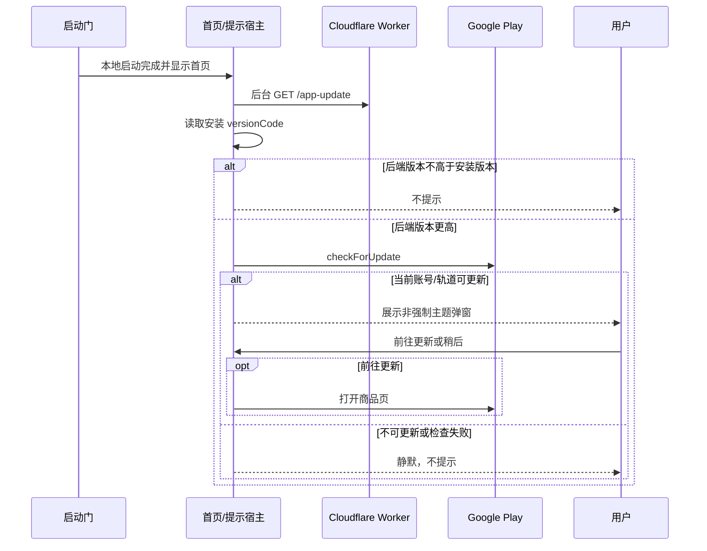

# App 启动更新提示设计

日期：2026-07-20

## 目标与边界

每次冷启动完成、首页已经可见后，在后台检查一次 PushupAI 的最新 Android 版本。如果后端发布清单声明了更高的 `versionCode`，且 Google Play 官方更新 API 同时确认当前账号与测试轨道确实有可用更新，则展示一次非强制更新弹窗。用户可以前往 Google Play，也可以稍后处理；本次选择不持久化，下次冷启动重新检查。

检查、解析、Google Play 查询或跳转失败都不能阻塞启动、登录、训练或本地记录。功能不实现强制更新、灰度分组、忽略某版本、应用内下载安装、后台轮询、D1 存储或管理后台。

## 方案选择

采用“Worker 发布清单 + Google Play 可用性确认”的组合方案：

- Worker 决定当前对用户宣传的最新版本和中英文更新内容，解决 Google Play 更新 API 不提供自定义更新清单的问题。
- App 只比较整数 `versionCode`，不解析或比较语义版本字符串。
- Google Play 官方信号负责确认当前 Google 账号和所在 Internal/Alpha/正式轨道确实能取得该更新，避免单一全局清单在多轨道发布期间误提示。
- 更新弹窗继续复用项目已经存在的原生 Google Play 商品页跳转与 HTTPS 网页兜底。

没有采用纯 Google Play 方案，因为它不能提供由我们维护的更新清单；没有采用 Remote Config/CMS，因为当前只有一个 Android 产品和两种语言，引入额外平台、权限与运维不符合最小实现原则。

## 后端接口

公开只读接口：

```http
GET /app-update?platform=android&locale=zh
```

成功响应：

```json
{
  "schemaVersion": 1,
  "platform": "android",
  "locale": "zh",
  "latest": {
    "versionCode": 17,
    "versionName": "0.3.14",
    "releaseNotes": [
      "月卡 3 天与年卡 7 天试用信息更清晰",
      "优化无试用资格时的套餐展示",
      "新增 Google Play 订阅管理入口"
    ]
  }
}
```

合同规则：

- `platform` 当前只接受 `android`；缺失或不支持时返回 `400 unsupported_platform`。
- `locale` 支持 `zh`、`en` 及带地区的值，其他值回退到英文；响应返回实际使用的语言。
- `versionCode` 是唯一更新比较依据；`versionName` 只展示。
- `releaseNotes` 为 1–6 条，每条是去除首尾空白后的非空短文本。
- 接口无需登录、Cookie、D1 或 Secret，响应使用 `Cache-Control: no-store`，避免发布清单在启动检查中长期滞留。
- 当前清单与 `pubspec.yaml` 版本必须一致。Worker 测试直接守护版本号、中英文内容及响应结构，因此以后只改 App 版本而遗漏更新提示时，`npm test` 会失败。

## App 数据流与时序



提示宿主只在冷启动门完成后挂载，并在首页首帧后发起检查。它在该宿主生命周期内只执行一次；主题、语言或账号状态重建不会重复检查。网络返回时若首页路由已不是当前路由（例如用户已进入训练），本次不弹窗，避免打断训练。

整个检查使用短超时。所有异常都折叠为“无提示”，不显示错误卡或重试按钮，也不影响设置页既有的版本号与商店入口。

## 分层与组件

- `workers/membership-api/src/app_update.ts`：版本化发布清单、语言回退和公开响应。
- `lib/product/app_update.dart`：纯 Dart 响应模型和严格合同解析。
- `lib/platform/membership_api_client.dart`：请求 Worker 清单。
- `lib/platform/app_version_service.dart`：读取安装 `versionCode`、查询 Google Play 更新可用性。
- `lib/control/app_update_checker.dart`：编排后端、安装版本和 Play 三项事实，失败关闭。
- `lib/platform/play_store_service.dart`：复用原生 Play 商品页与网页兜底。
- `lib/ui/app_update_prompt.dart`：一次性检查宿主与主题化弹窗。
- `lib/main.dart`：在启动门之后、首页之外组装依赖。

`product` 和 `control` 不引用 `AppLocalizations`。标题、按钮、失败提示进入 ARB；后端发布内容按 `locale` 返回。

## 弹窗视觉与交互

弹窗延续 V1 的友好、圆润、明亮方向，不引入紫色科技风或强制更新语气：

- 28dp 圆角主题 surface，顶部使用低饱和主题色版本徽标和下载图标。
- 标题为“发现新版本”，下一行突出 `PushupAI {versionName}`。
- “本次更新”下展示 1–6 条带小型绿色确认图标的更新内容；短屏可滚动。
- 底部提供次级文字按钮“稍后”和主按钮“前往更新”。点击遮罩、系统返回或“稍后”均直接关闭。
- 浅色、深色、中英文和 320×640 视口均不得溢出；按钮和内容提供标准 Material 语义与至少 48dp 触控区。

打开 Google Play 失败时沿用已有本地化 SnackBar，不改变更新状态。弹窗不会记录用户拒绝，也不会在同一次启动中再次出现。

## 发布同步规则

每次准备更高 `versionCode` 时必须同时更新 Worker 清单中的：

1. `versionCode` 与 `versionName`；
2. 中文 `releaseNotes`；
3. 英文 `releaseNotes`。

门禁测试会校验清单版本等于 `pubspec.yaml`。部署/发布顺序为：先让新 AAB 在目标测试轨道全面可用，再部署广告该版本的 Worker 清单；App 仍会用 Google Play 官方信号做第二次确认。Worker 部署、AAB 上传和轨道推进都是独立远程写入，仍需用户分别授权。

## 验证

- Worker：成功合同、语言回退、非法平台、方法限制、版本同步门禁。
- API 客户端：查询参数、严格解析、异常响应。
- 检查编排：新版本、同版本、Play 不可用、网络异常、超时。
- Widget：弹窗内容、稍后关闭、前往更新、跳转失败、无更新、浅深色/中英文/短屏。
- 回归：设置页版本入口继续打开同一 Play 商品页；`flutter analyze`、全量 `flutter test`、Worker `npm test`、`git diff --check`。

