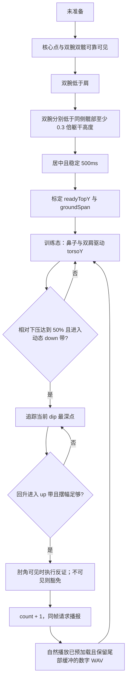

# 俯卧撑识别与计数体验整改记录（2026-07-13—2026-07-18）

> 状态：原整改已完成真机验收；2026-07-18 已用本轮新增的 App 内可导出诊断日志定位快速动作漏计并完成门控修正；商店 Release 真机验收仍待发布流程执行
>
> 分支：`feat/pushup-algo`
>
> 整改提交范围：`4528827`—本文所在提交
>
> 分支起点：`2f858d1`
>
> 当前算法定义以 [识别算法](modules/recognition.md) 为准；本文记录为什么改、怎么判断和哪些边界刻意没有处理。

## 1. 整改结论

本轮没有推翻“准备态用手腕建立地面基线、运动态用头肩轨迹计数”的核心设计，而是在真实近景约束下补齐了六个问题：

1. 计数管线重复平滑，导致回升计数偏慢、快动作容易漏计。
2. 准备后的浅幅姿势调整可能形成完整轨迹，被当作第一次正式动作。
3. 跪坐直立、双手自然下垂时，旧准备态规则可能误认为已经手撑地。
4. 算法已经产生计数后，数字 WAV 的前导近静音和首次加载继续拖慢听感。
5. 数字素材尾部缓冲太短，且连续计数会主动停止上一段播报，造成尾音像被截断。
6. 快速动作会让鼻或单肩置信度短暂跌破 0.3，运动态门控在 counter 之前丢掉关键底部帧。

整改后的职责边界是：

- **进入准备态前严格**：核心点、双腕、双髋必须可靠可见；双腕既要低于肩，也要分别明显低于同侧髋部，并稳定 500ms。
- **准备态完成时标定**：用头肩初始高度与双腕地面高度建立本次画面尺度。
- **进入训练态后宽容**：允许肘、腕、手臂因近景下压离开画面，继续使用头肩轨迹计数。
- **完整动作才计数**：至少下压准备态尺度的 50%，并回升到动态 up 带后计数。
- **播报链路不反向影响算法**：算法计数后立即发起播报；数字音频保留 20ms 前导余量和至少 80ms 尾部缓冲，在训练启动时后台预加载，并让连续数字自然播放完成。

## 2. 必须保留的真实使用场景

用户会把手机固定在正前方，并且可能距离镜头很近。近距离有一个不可回避的视觉特征：

- 准备时双腕仍可见，可以用来判断支撑位和标定地面高度；
- 真正下压后，肘部最先出框，随后手腕和部分手臂也可能无法识别；
- 鼻子和双肩通常仍在画面里，且它们随躯干形成稳定的上下轨迹。

因此，本项目不能采用“整个动作过程中必须持续看到手腕和肘部”的常规姿态规则。那会让近景标准俯卧撑在最关键的下压阶段冻结或漏计。

本轮确认的核心设计如下：

```text
准备态：双腕是地面参照，只在此阶段要求可靠可见
训练态：鼻子 + 双肩是主运动信号，腕和肘允许离屏
肘角：可见时只作反证，不可见时不否决完整头肩循环
```

这也是为什么腕髋门控只能放在 `ReadyPoseGate`，不能加入 `motionPoseUsable` 或 `PushupCounter`。

## 3. 问题、证据、根因与整改对照

| 问题 | 关键证据 | 根因 | 整改 | 状态 |
|---|---|---|---|---|
| 完成动作后计数偏慢 | 管线和计数器各有一层 5 帧平滑 | 同一位移信号被连续平滑两次 | 删除 Pipeline 移动平均，只保留 Counter 的 5 帧中值滤波 | 已完成 |
| 快动作偶尔漏计 | 3 帧下压 + 3 帧回升会被重复平滑拖后 | 回升信号不能及时跨过 up 带 | 增加快动作回归测试并移除重复滤波 | 已完成 |
| 快速动作仍会漏计 | 三次完整真机日志旧算法回放为 5/8/10；第二、三组的动作空档里鼻或单肩短暂低于 0.3，且用户确认这两组存在漏计 | `motionPoseUsable` 要求鼻和双肩每一点都达到 0.3，先于 counter 丢弃关键底部帧 | 每个核心点保留 0.25 下限，双肩平均仍要求 0.3；举手反证仍按 0.3 | 已完成并真机复验 |
| 准备后调整被计为第一次 | 真机疑似调整达到准备态尺度约 45%，有效动作最低约 57% | 原计数器只有近期动态幅值，没有本次拍摄尺度下的最低正式深度 | ready 时标定头肩—地面尺度，要求至少下压 50% 才能进入 down | 已完成 |
| 跪坐垂手误进准备态 | 腕低于肩且稳定 514ms，但腕与髋几乎同高 | 旧门控检查髋置信度，却不检查腕相对髋的位置 | 双侧分别要求 `腕髋距离 >= 0.3 × 同侧躯干高度` | 已完成 |
| 数字播报仍显得晚 | 算法通常在身体到顶前触发；30 个 WAV 人声平均约 267ms 才出现 | 音频前导近静音 + 每个数字首次按需加载 | 前导余量统一为 20ms；启动训练时后台预加载 1—30 | 已完成 |
| 数字尾音像被截断 | 18/30 个素材尾部缓冲不足 50ms，6 个不足 20ms；播放器更换数字前会主动停止 | 原素材尾部安全余量不足，连续播放策略允许后一数字中断前一数字 | 原人声波形不动，只追加 80ms 静音；数字播报串行等待上一段自然结束 | 已完成，待真机复验 |

## 4. 整改过程与关键判断

### 4.1 先处理重复平滑，不提前计数定义

`PushupCounter` 本身已经使用 5 帧中值滤波抑制单帧毛刺，`PushupPipeline` 之前又使用 5 帧移动平均。两层滤波的收益重复，但延迟会叠加。

本轮删除 Pipeline 层移动平均，保留 Counter 中值滤波。这样没有改变“回升到 up 带才完成一次动作”的产品定义，只删除了装配层多余的滞后。

同时加入快速循环回归：稳定顶位后，3 帧下压 + 3 帧回升必须能计数一次。这个测试直接守护用户“做快了不能漏”的场景。

对应提交：

- `4528827`：识别追踪与延迟整改设计。
- `9f0cc3d`：移除重复平滑并增加快动作保护。

### 4.2 先补齐 Debug 证据，再判断疑似误计

第一类疑似问题不能只靠主观回忆判断，因此 Debug 包新增 JSONL 识别轨迹：

- session 开始、结束、ready、lost-pose、stable 翻转和 count 事件；
- 每个已处理帧的关键点、准备门控、运动态可用性、计数前后状态；
- 头肩位置、肘角、相对深度、处理耗时和丢帧数；
- 仅保留最近 10 次训练，写入失败不得影响训练；
- 仅 Debug 启用，文件留在 App 私有目录，不上传、不进入 Git。

两次重点训练中，一次产生 20 个 count 事件，用户怀疑前几下多计一次；另一次产生 15 个 count 事件，用户确认与实际动作一致。轨迹显示，问题不是“ready 瞬间凭空加一”，而是 ready 后的一次下压—回升调整满足了旧的完整轨迹条件。

对应提交：`10c38a9`。

### 4.3 用准备态画面尺度定义正式下压深度

固定像素阈值不能同时适应近景和远景：

- 人物越近，头肩到地面的画面距离越大，真实俯卧撑对应的像素位移也越大；
- 人物越远，同一个真实动作在画面中的像素位移越小。

ready 通过时保存：

- `readyTopY`：鼻子与双肩组成的初始头肩高度；
- 左右手腕各自的地面高度；
- `groundSpan`：两个头肩—手腕高度距离中更大的一个。

训练中的相对深度为：

```text
(当前头肩高度 - readyTopY) / groundSpan
```

只有相对深度达到 50%，已武装的计数器才允许进入 down。随后仍沿用已有的最低点追踪、动态滞回、回升计数和可选肘角反证。

选择 50% 的依据不是猜测：当时两组轨迹中，疑似调整约为 45%，其余有效动作约为 57%—77%。50% 位于两类样本之间，并保留继续用新日志校准的余地。

双腕不能平均。左右手腕是两个独立支撑点，一侧异常不应被另一侧“平均掉”。标定时分别验证后选择更靠下、偏保守的地面高度。

对应提交：

- `abaa7fd`：准备态相对深度设计与实施计划。
- `c3fc278`：50% 相对深度接入 Pipeline、Counter、Controller 和 Debug 轨迹。

### 4.4 腕髋条件只收紧准备态

相对深度上线后的真机测试计数表现良好，但暴露了另一类问题：用户跪在地上、上身坐立、双手自然下垂，还未真正手撑地时，也可能进入 ready。

旧规则要求腕低于肩，因此自然垂手可以通过；双髋虽然必须可见，却只检查了置信度。样本汇总中：

- 正常支撑姿势的双侧腕髋/躯干比例最低约为 0.54 和 0.70；
- 坐立垂手窗口最高约为 0.27 和 0.02。

因此采用 0.3，并要求左右两侧分别满足：

```text
torsoHeight = hipY - shoulderY > 0
wristY - hipY >= 0.3 × torsoHeight
```

该条件只存在于 `ReadyPoseGate.isPoseVisible`。进入 ready 后，运动态门控和计数器保持不变，所以不会破坏近景手臂离屏计数体验。

没有采用膝、踝地面线，因为近景准备阶段膝踝也可能出框；没有采用固定腕髋像素，因为它会重新引入拍摄距离问题。

对应提交：

- `0143d2b`：腕髋门控设计。
- `0e8eeb6`：腕髋门控实施计划。
- `c640627`：ready-only 双侧 0.3 腕髋门控与回归测试。

### 4.5 区分“算法计数晚”和“人声出现晚”

真机轨迹与 WAV 检测给出了清晰的延迟分解：

- 最新一组 15 次训练的推理处理平均约 34.2ms，p95 约 52.4ms，仅丢 2 帧，不构成数百毫秒级瓶颈；
- 算法 count 事件相对随后原始头肩最高点，中位数约提前 173ms；
- count 事件发生后，Controller 在同一帧立即以 `unawaited` 发起播报；
- 修改前，30 个数字 WAV 的可听人声起点约为 155—341ms，平均约 267ms。

因此不能继续提前算法回升阈值。算法多数时候已经在身体完全到顶前计数，再提前会增加半程动作误计风险。真正应修的是音频资源和加载路径。

整改内容：

- 只裁切 `count_01.wav`—`count_30.wav`，不改 `guide.wav` 和 `ready.wav`；
- 当前播放目录与曼波源素材同步裁切，避免以后复制主题时把旧静音重新带回；
- 每个数字保留 20ms 前导余量，避免切掉起音；
- 增加契约测试：可听人声必须在 50ms 内出现，播放目录必须与源主题一致；
- 训练开始时使用已安装依赖的 `AudioCache.loadAll` 后台预加载 1—30；预加载失败时仍按需播放，不阻断训练；
- 不切换 SoundPool/低延迟模式。当前单播放器会连续更换 30 个不同音源，贸然切换会引入额外原生状态风险，而裁切与缓存已经解决已证实的根因。

整改后 30 个文件的检测起点均为 20ms。真机覆盖安装后，用户确认本次播报体验很好。

对应提交：`d27321b`。

### 4.6 尾音只补缓冲，不重新裁切人声

用户后续真机体验发现数字尾音像被截断。逐采样比较裁切提交前后的 30 个 WAV 后确认：当前文件都与原文件后半段完全一致，之前只删除了前导静音，没有删除任何尾部采样；但原素材在最后一个高于 -40dBFS 的采样后，尾部缓冲只有 6.75—71.75ms，中位数 36.85ms，其中 18 个不足 50ms、6 个不足 20ms。

播放器还会在每次更换音源前执行 `stop()`；Android `audioplayers` 的 `setSource` 也会重置底层播放器，因此仅删除显式 `stop()` 不能保证上一数字完整播放。

本次修正保持边界最小：

- 30 个数字的人声波形和 20ms 前导余量完全不动，只在末尾追加精确 80ms 零采样；
- 播放目录与曼波源素材同步更新，继续保持逐字节一致；
- 只对数字计数串行化，后一数字等待前一数字自然结束；
- 引导语、准备语仍可被阶段切换覆盖，避免第一次计数被长提示音延迟；
- 训练停止、销毁或提示阶段变化时仍立即取消旧队列，防止离开页面后继续播报；
- 新增尾部缓冲和连续数字自然结束的回归测试，不改识别、门控或计数算法。

对应提交：本文所在提交。

### 4.7 用完整训练日志定位快速动作的门控漏帧

2026-07-18 的三次完整训练日志可用旧算法精确离线复现为 5/8/10。第二、三组用户均观察到快速动作漏计；逐帧核对显示：

- 进入 counter 的每个完整 `down → up` 都成功计数，没有肘角否决；
- 漏计空档内主要是鼻或单侧肩膀置信度短暂跌破 0.3，不是手腕抬起反证；
- 第一组没有相同漏计现象，可作为本轮负对照。

因此根因不在位移阈值、ready 相对深度或 counter 相位机，而在 `motionPoseUsable` 对三个核心点使用了过严的逐点 0.3 AND。离线比较后采用最保守的放宽：鼻与双肩每点仍须 ≥0.25，双肩平均仍须 ≥0.3，手腕举手反证继续使用 0.3。把实际生产代码回放到同一批日志后得到 5/9/12：第一组不增计，第二、三组分别恢复 1 和 2 个落在原漏计空档内的完整循环。

新增合成会话回归覆盖快速动作时鼻或单肩短暂落在 0.25—0.30；同时守护任一核心点低于 0.25、双肩平均低于 0.3 和高置信可见抬手仍被拒绝。真实 JSONL 只在本机私下分析，没有进入 Git 或测试夹具。

修正包覆盖安装后的三组真机复验均计为 10。第二、三组最快相邻计数约为 0.74 秒和 0.73 秒，十次循环全部连续；各组最低下压峰值比例约为 0.70、0.65、0.66，均超过 50% 正式深度线。三组分别有 10、7、5 帧核心点置信度落在 0.25—0.30 并被新门控接受，说明容忍分支实际参与运行。继续把核心点下限放宽到 0.20、只保留 counter 门控或把深度线降到 45% 均未产生第 11 个候选，因此不再继续调低阈值。

## 5. 当前完整识别与计数流程



### 5.1 准备态不变量

- 鼻、双肩、双腕、双髋置信度均达到 0.3。
- 双腕低于双肩。
- 双侧腕髋比例均达到 0.3，禁止左右平均。
- 姿态居中并稳定 500ms。
- 标定失败不得进入正式计数。

### 5.2 运动态不变量

- 主信号只依赖头肩轨迹和肩置信度。
- `handsStable` 只保留诊断意义，不冻结计数。
- 明确可见的抬手仍是反证；低置信或出框腕部不是失败。
- 肘角仅在 dip 与返回阶段都可靠可见时否决明显直臂/固定弯肘晃动。
- 不可用帧 hold 状态，不推进、不回退、不清零。
- lost-pose、重新 ready 或切换相机时清瞬时状态和标定，但保留已完成次数。

### 5.3 计数时刻

一次动作在“下压达到最低要求并回升进入 up 带”时完成，不在最低点计数。这保证半程下压不会记数，同时不要求回到准备态完全相同的像素高度。

## 6. 刻意没有采用的方案

| 方案 | 不采用原因 |
|---|---|
| 运动态持续要求手腕稳定 | 近景透视抖动和腕部离屏会冻结真实动作 |
| 运动态持续要求肘角可见 | 肘部是近景下压时最先出框的关键点 |
| 平均左右手腕 | 两腕是独立支撑点，一侧异常会污染平均值；这是历史 bug 根源 |
| 用统一固定像素定义正式深度 | 近景和远景的画面尺度不同 |
| 要求回到 ready 初始顶部才计数 | 训练中顶部会自然漂移，会增加快动作漏计 |
| 腕髋条件加入 motion gate | 会破坏已经验证良好的手臂离屏计数 |
| 用膝踝辅助判断手撑地 | 近景时膝踝可能出框 |
| 为播报继续提前算法阈值 | 真机证据显示算法已经提前于身体完全到顶 |
| 直接切换低延迟原生播放器 | 未证明是当前瓶颈，且会扩大原生播放状态风险 |

## 7. 代码与提交索引

| 提交 | 作用 | 主要文件 |
|---|---|---|
| `4528827` | 识别追踪与延迟整改设计 | `docs/plans/2026-07-13-recognition-trace-and-latency-design.md` |
| `9f0cc3d` | 删除重复平滑，保护快动作 | `pushup_pipeline.dart`、`pushup_pipeline_test.dart` |
| `10c38a9` | Debug JSONL 识别轨迹 | `recognition_trace_log.dart`、`workout_controller.dart` |
| `abaa7fd` | 准备态相对深度设计与计划 | `docs/plans/2026-07-13-ready-relative-depth-*` |
| `c3fc278` | 接入 50% ready-relative 深度 | `pushup_domain.dart`、`pushup_pipeline.dart`、`workout_controller.dart` |
| `0143d2b` | 腕髋门控设计 | `docs/plans/2026-07-13-ready-pose-wrist-hip-gate-design.md` |
| `0e8eeb6` | 腕髋门控实施计划 | `docs/plans/2026-07-13-ready-pose-wrist-hip-gate-implementation.md` |
| `c640627` | 实现 ready-only 腕髋门控 | `ready_pose_gate.dart`、`ready_pose_gate_test.dart` |
| `d27321b` | 裁切计数 WAV 并后台预加载 | `voice_prompt_player.dart`、计数 WAV、`voice_prompt_assets_test.dart` |
| 本文所在提交 | 保留数字尾音并串行自然播放 | `voice_prompt_player.dart`、计数 WAV、`voice_prompt_assets_test.dart` |

## 8. 验证记录

### 8.1 自动化验证

2026-07-14 在 `feat/pushup-algo` 上实际执行：

- `flutter analyze`：无 issue。
- `flutter test`：322 项全部通过。
- 回放硬基线由全量测试守护：step0=5、v3=5、v4=3。
- `test/voice_prompt_assets_test.dart`：2 项通过。
- 30 个计数 WAV：PCM_16、单声道、24000Hz；可听起点均为 20ms，契约上限为 50ms。
- `git diff --check`：通过。
- 带本机 Debug 配置的 APK：构建成功。

2026-07-15 在 `feat/pushup-algo` 上实际执行：

- `flutter analyze`：无 issue。
- `flutter test`：365 项全部通过，回放硬基线保持 step0=5、v3=5、v4=3。
- `test/voice_prompt_assets_test.dart`：4 项通过。
- 30 个计数 WAV 的原有人声波形全部保持不变，各追加精确 80ms 零采样；播放目录与曼波源素材一致。
- `git diff --check`：通过。

2026-07-18 在 `feat/algo-opt-2026-07` 上实际执行：

- `flutter analyze`：无 issue。
- `flutter test`：467 项全部通过，回放硬基线保持 step0=5、v3=5、v4=3。
- 快速动作核心点降置信、0.25/0.30 精确边界、小尺度 60% 正例、45% 负例和约 25px 抖动负例均由自动化测试守护。
- `git diff --check`：通过。
- 独立六维只读审查完成两轮，最终 P0/P1/P2 均为零。

### 8.2 真机验证

- Debug 识别轨迹已能连接电脑读取并用于回溯两组训练。
- 相对深度改动后，用户完成两轮真机动作并反馈计数体验良好。
- 跪坐垂手误 ready 的根因由轨迹确认，随后增加 ready-only 腕髋门控。
- 2026-07-14 使用仅构建参数生成 versionCode 5 的 Debug APK，覆盖安装成功，未卸载、未清数据。
- 音频裁切与预加载版本真机测试后，用户反馈“这次测试的效果很好”。
- 2026-07-15 尾音缓冲与自然播放修正尚未构建或安装，真机听感待本提交审核合并后复验。
- 2026-07-18 快速动作门控修正包覆盖安装成功，未卸载、未清数据；三组新训练均计为 10，最快约 0.73 秒一次，没有漏计、误计或隐藏完整循环候选。
- 2026-07-18 窄距俯卧撑首轮正面固定机位对照通过：合格姿势连续计 1—5，放宽双手期间 18 秒无新增计数，恢复合格姿势后计为 6；结构化轨迹在间隔内有 238 帧明确判为 `doesNotMatch`，两次边界计数帧均为 `matches`，无 frame error。常规模式稍宽手位连续计 1—3，类型保持 `pushup`。该结果仅覆盖单用户、单机位，近远景、透视、遮挡、多用户/机型仍待发布前补充。

以上真机反馈是用户验收事实；自动化结果是本会话实际执行结果。未把真实视频、原始 JSONL、设备标识或用户数据纳入 Git。

## 9. 已知边界

1. **单目 2D 无法证明手掌真实接触地面。** 腕低于肩、腕明显低于髋只是支撑姿势的二维替代条件；刻意摆出相同几何关系仍可能骗过门控。
2. **模型完全看不到人时算法无法补救。** 极近距离导致鼻和双肩也丢失后，只能触发 lost-pose 并重新准备。
3. **相机平移不再专门防护。** 运动态移除了 WristAnchor 硬门控；App 的前提仍是固定机位。
4. **50% 和 0.3 是有样本依据的首轮阈值，不是人体运动学真理。** 后续只能依据新增真机正负样本调整，不能凭单次感觉改动。
5. **30 次以后不播数字。** 这是当前 VoicePromptPlayer 的既有产品上限，与本轮延迟整改无关。
6. **预加载是优化，不是计数依赖。** 预加载失败时回退到按需加载，不能让音频故障阻断训练。
7. **极快计数时语音可能短暂排队。** 为保证尾音完整，后一数字会等待前一数字结束；当前最长数字约 733ms，正常俯卧撑节奏不应累积，异常快速信号以不截断为优先。

## 10. 后续修改纪律

以后收到“误计、漏计、计数慢、播报慢”反馈时，先按链路拆分，不要直接调阈值：

1. 查看 count 事件是否已经及时产生。
2. 查看 ready 标定值、逐帧相对深度和 phase 变化。
3. 查看 inference 处理耗时与 dropped frames。
4. 若 count 已及时产生，再检查播放器请求、缓存和 WAV 起音。
5. 每个可复现问题先增加最小失败测试或脱敏 fixture，再修改最低层根因。
6. 任何运动态手腕/肘部硬门控提案，都必须先用近景手臂离屏回放证明不会破坏真实动作。
7. 调整 `readyDepthRatio` 或 `minWristBelowHipRatio` 时，必须同时保留误触发负样本和正常近/远景正样本。

## 11. 集成与回滚说明

原整改分支起点是 `2f858d1`；2026-07-15 已对齐 `main` 的 `dfc1301`，本次尾音修正直接位于该基线上。主分支审核者合并后仍应重新运行 `flutter analyze`、`flutter test` 和真机语音检查；不要以本记录代替合并后的验证。

若需要分项回滚，优先按提交逆向 revert：

- 只回滚尾音缓冲与自然播放：revert 本文所在提交。
- 只回滚原音频延迟整改：`d27321b`。
- 只回滚准备态腕髋门控：`c640627`（设计记录可保留）。
- 只回滚相对深度：`c3fc278`，同时检查相关文档与测试。
- 只回滚 Debug 轨迹：`10c38a9`。
- 只回滚重复平滑删除：`9f0cc3d`，但会重新引入已确认的计数滞后和快动作风险。

回滚算法提交后必须重跑 step0=5、v3=5、v4=3 和近景手臂离屏用例。
