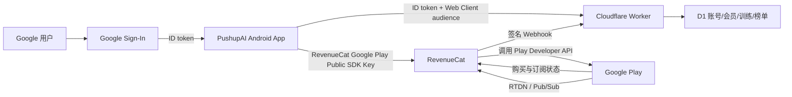

# PushupAI 发布、账号、订阅与后端配置台账

最后核对：2026-07-15

适用应用：Google Play 中文名“AI俯卧撑”，英文名“PushupAI”

Android 包名：`com.ugkexercise.ugk_exercise`

> 本文用于让没有参与过首次配置的人或 agent 接手发布工作。它记录“在哪里配置、配置了什么、为什么需要、目前完成到哪里”。
>
> 本文可以进入仓库，因此不保存真实 Google Client ID、RevenueCat API Key、服务账号私钥、签名密码、Cloudflare Token 或 Worker Secret。带账号标识和本机秘密文件位置的私密台账在 `E:\AII\secrets\PushupAI-发布与密钥台账.md`。

功能改完后该走本地、内部测试还是 Alpha，先按 [开发测试与发布手册](testing-release-playbook.md) 分流。

## 1. 当前状态摘要

| 项目 | 状态 | 当前事实 |
|---|---|---|
| Google Play 应用 | 已创建 | 应用、免费、默认语言 `zh-CN`；免费应用仍可销售应用内订阅 |
| Play App Signing | 已启用 | Google 持有“应用签名密钥”；本机持有单独的“上传密钥” |
| 内部测试已发布版本 | `0.3.7 (8)` USER REPORTED PUBLISHED | 用户报告该版本已通过内部测试审核，并已在测试机从 Google Play 安装；本会话未读取 Console 或设备证据 |
| 内部测试 | UPGRADE SMOKE PASS（用户报告） | 两次冷启动未重复出现引导；登录、头像、主题和历史记录保留；首页测试按钮隐藏，浅/深色显示正常 |
| 封闭测试 | PASS | 用户报告 `0.3.4-closed-1` 已于 2026-07-14 10:42 在 Google Play 面向 Alpha 测试人员全面发布 |
| Play 安装 | `0.3.7 (8)` USER REPORTED SMOKE PASS | 用户报告测试机安装并完成升级保留冒烟；安装来源和签名属性尚未在本会话独立复核 |
| Google OAuth | 已验证 | Play 签名版真机登录成功 |
| RevenueCat Google Play App | 已创建 | 已绑定同一包名，Production/Google Play Public SDK Key 已用于 release 构建 |
| RevenueCat 服务凭据 | 已上传并可用 | Google 官方权限与 API 已配置；RTDN 测试通知已被 RevenueCat 接收 |
| Google RTDN | PASS | Topic 已连接，Play 测试通知成功，RevenueCat 显示最近接收时间 |
| Play License Testing | PASS | 许可测试名单已生效；购买页显示 Google 测试卡和测试订阅声明，未使用真实付款方式 |
| Google Play 订阅商品 | 已激活 | `premium` 下的 `monthly` 与 `annual` 自动续订 base plan 已覆盖 174 个国家/地区并启用 |
| RevenueCat 商品映射 | 已完成 | Google Play 月度/年度商品均关联 `premium` entitlement，并加入当前 `default` Offering 的标准 Package |
| Google Play Sandbox 购买 | PASS（License Tester Debug） | Google 官方允许 License Tester 使用同包名侧载 Debug；月度购买/续订/过期、年度购买、RevenueCat entitlement、App 重启恢复及 Webhook→D1 均已验证，未进行真实购买 |
| Cloudflare Worker/D1 | 会员 Webhook→D1 PASS | 年度 `INITIAL_PURCHASE`、月度续订/取消/过期事件和 active 快照已只读核验；远端 `/membership` 鉴权响应未独立抓取 |
| 当前设备验收 | Play 安装版会员恢复 PASS | 侧载 Debug 已验证月度/年度 Sandbox 购买链；Play 安装版已验证 Google 登录、现有年度 Sandbox 会员恢复及重启保持 |

## 2. 各系统如何关联



必须分清两条通知链：

- **Google RTDN**：Google Play → Google Cloud Pub/Sub → RevenueCat。让 RevenueCat 尽快知道续费、取消、退款、付款失败等商店事件。
- **RevenueCat Webhook**：RevenueCat → Cloudflare Worker → D1。让本项目后端把 RevenueCat 的 `premium` 权益同步成服务端会员状态。

这两条链不是同一件事。只配其中一条会造成会员状态延迟或后端状态缺失。

## 3. Google Play Console

入口：[Google Play Console](https://play.google.com/console/)

### 3.1 创建应用

位置：Play Console 首页 → “创建应用”。

已配置：

- 中文商店名称：`AI俯卧撑`
- 英文商店名称：`PushupAI`
- 包名：`com.ugkexercise.ugk_exercise`
- 默认语言：简体中文 `zh-CN`
- 类型：应用
- 定价：免费

目的：在 Google Play 中建立不可混淆的应用身份。包名是 OAuth、RevenueCat、Billing、Play App Signing 和后续所有版本共同使用的主键，不能随意变更。

### 3.2 Play App Signing 与两个签名密钥

新版网页位置：应用 → “由 Google Play 提供保护” → “Play 商店保护” → “Play 应用签名”。

这里有两个完全不同的证书：

| 名称 | 谁持有 | 用途 |
|---|---|---|
| 上传密钥 | 本机开发者 | 给上传的 `.aab` 签名，Google 用它确认上传者身份 |
| 应用签名密钥 | Google Play | 给用户实际下载的 APK 签名；Google OAuth 必须登记这个证书的 SHA-1 |

首次 AAB 已使用本机上传密钥签名。Play 安装包的 Google 登录能成功，是因为已从“应用签名密钥证书”复制 SHA-1，并在 Google Cloud 建立对应 Android OAuth Client。

重要：不要把“上传密钥 SHA-1”填成 Play 分发版 OAuth 的 SHA-1。

### 3.3 内部测试

位置：应用 → “测试和发布” → “测试” → “内部测试”。

已完成：

- 发布名称：`0.3.0-internal-1`
- 版本：`0.3.0 (1)`
- Android：API 24 及以上；上传页面显示目标 API 35
- 测试名单：`PushupAI Internal Testers`
- 测试人员已通过 opt-in 链接加入，并从 Google Play 安装

“尚未审核”不等于公开发布失败；这是内部测试轨道，只有名单中的账号通过加入链接才能获取。

内部测试名单位置：内部测试 → “测试人员” → 选择邮件列表 → 保存。加入链接也在这个页面。

### 3.4 RevenueCat 服务账号的 Play 权限

位置：Play Console 首页（账号级）→ “用户和权限” → RevenueCat 服务账号。

该服务账号已被添加为有效用户，并仅授予当前应用所需的三项权限：

- 查看应用信息和批量下载报告（只读）
- 查看财务数据
- 管理订单和订阅

未授予管理员、正式发布、测试轨道发布或商店资料编辑权限。

目的：RevenueCat 需要读取商品、订阅、订单和取消状态，但不应该拥有发布 App 或修改商店资料的能力。

### 3.5 License Testing（已通过 Play 安装包核验）

注意：这是 **Play Console 首页的账号级设置**，不是某个 App 页面里的设置。

位置：Play Console 首页 → “设置” → “许可测试 / License testing”。

已完成：

1. 选择当前内部测试使用的邮件列表或测试 Google 账号。
2. 保存更改。

Sandbox 购买时必须：

3. 购买弹窗必须明确显示 Google 的测试支付方式，例如 “Test card, always approves”。
4. 如果出现真实银行卡或真实金额扣费入口，立即取消，不能继续。

内部测试人员不自动等于 License Tester。只有 License Tester 才能使用不会真实扣款的测试支付方式。

2026-07-14 首次在侧载 Debug 包中看到真实支付入口并立即取消，原因是 License Testing 邮件列表尚未被实际勾选。勾选并保存名单后，同一侧载 Debug `0.3.5 (6)` 显示 `Test card, always approves` 与测试订阅声明，License Testing 验收通过。Google 官方允许 License Tester 使用同包名侧载 Debug 测试 Billing；该结果不证明 Play App Signing 分发包的安装、签名或更新链路。

### 3.6 Google Play 订阅商品（已激活）

位置：应用 → “通过 Play 创收 / Monetize with Play” → “商品” → “订阅”。

当前配置：

- Subscription Product ID：`premium`。
- `monthly`：每月自动续订，美国区基准价 `$2.99`，已启用。
- `annual`：每年自动续订，美国区基准价 `$20.00`，已启用。
- 两档均覆盖 174 个国家/地区；用户实际看到的价格以 Google Play 本地化价格为准。
- 月度宽限期 7 天、自动账号冻结期 53 天；年度宽限期 14 天、自动账号冻结期 46 天；两档均允许重新订阅。

Product ID 和 Base Plan ID 一旦启用后不能随意改名或复用，创建前应由用户确认产品命名、周期和价格，不能由 agent 猜测。

### 3.7 Google RTDN（已完成）

位置：应用 → “通过 Play 创收” → “变现设置 / Monetization setup” → “实时开发者通知”。

RevenueCat 已成功创建并连接：

`projects/healthhelper-482705/topics/Play-Store-Notifications`

已完成：

1. 从 RevenueCat 复制完整 Topic 名称，格式类似 `projects/.../topics/...`。
2. 粘贴到 Play Console 的 Topic name。
3. 通知内容选择订阅、作废购买和所有一次性商品。
4. 保存。
5. 点击“发送测试通知”。
6. 回 RevenueCat 确认出现最近接收时间。

## 4. Google Cloud 与 Google OAuth

项目入口：[Google Cloud 项目](https://console.cloud.google.com/home/dashboard?project=healthhelper-482705)

项目显示名称：`HealthHelper`

项目 ID：`healthhelper-482705`

### 4.1 Google OAuth 客户端

位置：[Google Auth Platform → 客户端](https://console.cloud.google.com/auth/clients?project=healthhelper-482705)。

现有三类客户端承担不同职责：

| 客户端 | 作用 | 本项目怎么用 |
|---|---|---|
| Web OAuth Client | 作为 Google ID token 的 server audience | 通过 `UGK_GOOGLE_SERVER_CLIENT_ID` 注入 App；Worker 的 `GOOGLE_CLIENT_ID` 必须匹配 |
| Android OAuth Client：`PushupAI Google Play` | 允许 Play 签名的 Android App 发起 Google 登录 | 绑定包名 + Play“应用签名密钥证书”SHA-1 |
| Android OAuth Client：`UGK Android Debug` | 允许本机 Debug 包发起 Google 登录 | 绑定包名 `com.ugkexercise.ugk_exercise` + 当前 Windows 用户默认 Debug 证书 SHA-1 `6B:D0:20:64:89:68:3B:63:6A:BA:52:68:6A:9C:5A:CF:1B:5F:4B:2B` |

Android Client 创建后不需要下载 JSON，也不需要把 Android Client ID 写入 Flutter 代码。代码使用的是 Web Client ID 作为 `serverClientId`。

`UGK Android Debug` 已于 2026-07-11 用本机 `debug` variant 的 `signingReport` 复核。该证书指纹是公开身份信息，不是私钥；真正的 keystore、密码和会员配置文件仍只保存在本机，禁止复制进仓库或聊天。

### 4.2 OAuth 受众和测试用户

位置：[Google Auth Platform → 目标对象/受众群体](https://console.cloud.google.com/auth/audience?project=healthhelper-482705)。

当前：

- 用户类型：外部
- 发布状态：测试
- 测试账号已加入测试用户列表

目的：OAuth 处于测试状态时，只允许受控账号完成授权。正式公开发布前，需要重新评估 OAuth 发布状态、品牌信息、数据访问范围和是否需要验证。

### 4.3 RevenueCat 服务账号与 GCP 角色

位置：[IAM](https://console.cloud.google.com/iam-admin/iam?project=healthhelper-482705) 和 [服务账号](https://console.cloud.google.com/iam-admin/serviceaccounts?project=healthhelper-482705)。

已创建 RevenueCat 专用服务账号。当前项目角色：

- `Monitoring Viewer`
- `Pub/Sub Admin`

最初使用 `Pub/Sub Editor`，RevenueCat 在创建 Pub/Sub Topic 时仍返回无权限。按 RevenueCat 官方排障建议改成 `Pub/Sub Admin` 后，权限传播完成，RevenueCat 已连接成功。

目的：

- 服务账号 JSON 让 RevenueCat 服务器代表本项目调用 Google Play Developer API。
- Monitoring Viewer 用来监控通知队列。
- Pub/Sub Admin 用来让 RevenueCat 创建和连接开发者通知 Topic。

### 4.4 已启用 API

- [Google Play Android Developer API](https://console.cloud.google.com/apis/library/androidpublisher.googleapis.com?project=healthhelper-482705)
- [Google Play Developer Reporting API](https://console.cloud.google.com/apis/library/playdeveloperreporting.googleapis.com?project=healthhelper-482705)
- [Cloud Pub/Sub API](https://console.cloud.google.com/apis/library/pubsub.googleapis.com?project=healthhelper-482705)

### 4.5 RTDN 权限仍失败时

先等待 IAM 和服务凭据传播，不要反复新建服务账号。若 RevenueCat 已能创建 Topic，但 Play 的测试通知发送失败，则在该 Topic 的“权限”页给以下 Google 系统服务账号授予 `Pub/Sub Publisher`：

`google-play-developer-notifications@system.gserviceaccount.com`

这只在测试通知失败时添加，不要提前扩大其他账号权限。

## 5. RevenueCat

入口：[RevenueCat Dashboard](https://app.revenuecat.com/)

### 5.1 已创建的 Google Play App

位置：RevenueCat 项目 → Apps & providers / Apps → `PushupAI (Google Play)`。

已配置：

- App name：`PushupAI (Google Play)`
- Google Play package：`com.ugkexercise.ugk_exercise`
- Custom URL Scheme：已由 RevenueCat 生成，见私密台账
- Service Account Credentials JSON：已上传
- Public SDK Key：已写入本机 production build 配置文件，文档不抄值
- Financial reports bucket ID：保持空白

Financial reports bucket 主要用于财务报告导入，新应用当前不依赖它完成购买验证。

Custom URL Scheme 主要服务 RevenueCat paywall preview/deep link；当前 App 使用自定义会员弹窗，尚未把该 scheme 注册到 Android。除非开始使用 RevenueCat paywall preview，否则不是当前阻塞项。

### 5.2 Test Store 与 Google Play Store 的区别

- Debug/旧测试配置使用 RevenueCat Test Store key（前缀为 `test_`），只用于开发模拟。
- Play release 使用 Google Play Public SDK Key（前缀为 `goog_`），会走 Google Play Billing。
- `validateMembershipConfig()` 会拒绝 release 使用 Test Store key。

绝不能把 Test Store key 打进上传 Google Play 的 release 包。

### 5.3 Entitlement、Product、Package、Offering

代码固定检查 entitlement ID：`premium`。

代码购买流程会读取 RevenueCat 的 `current` Offering，展示标准月度/年度 Package，并购买用户明确选择的套餐。当前映射：

- `$rc_monthly` → Google Play `premium:monthly`；同时保留 Test Store Monthly 供本地测试。
- `$rc_annual` → Google Play `premium:annual`；不配置旧 SDK fallback。
- 两个 Google Play 商品均关联 entitlement `premium`。
- `default` 是当前 Offering。

漏掉任一关联都会出现“购买入口存在但没有可购买 Package”或购买后不解锁 `premium`。

### 5.4 Sandbox Testing Access

位置：RevenueCat 项目 → Project Settings → General → Sandbox Testing Access。

首次内部 QA 可选 `Anybody`；若选择 `Allowed App User IDs only`，必须把当前 App 登录后由 Worker 分配的 App User ID 加入 allowlist。该设置影响 Test Store 和 Google Play sandbox 是否授予 entitlement，但不会阻止交易被记录。

正式购买测试前必须确认这里不是 `Nobody`。

查看测试 Customer 时还必须开启 RevenueCat Dashboard 的 `Show sandbox data`。关闭该开关时，Customer Profile 会按正式数据视图显示 `No current entitlements`，不能据此判断测试权益失败。

### 5.5 Google Developer Notifications 当前状态

位置：Google Play App 设置 → Service credentials 下方 → Google developer notifications。

Topic ID `Play-Store-Notifications` 已连接成功，完整路径为：

`projects/healthhelper-482705/topics/Play-Store-Notifications`

Play Console 已启用实时通知，通知内容选择订阅、作废购买和所有一次性商品；测试通知发送成功。RevenueCat 显示 `Last received 2026-07-10, 6:13 p.m. UTC`，RTDN 全链路已通过。

成功标准：

- RevenueCat 页面显示完整 Topic ID。
- Play Console 能保存该 Topic。
- Play “发送测试通知”成功。
- RevenueCat 显示最近收到通知的时间。

## 6. Android release 构建和本地签名

### 6.1 构建时配置

代码只认以下三个 `dart-define` 名称：

- `UGK_MEMBERSHIP_API_BASE_URL`
- `UGK_GOOGLE_SERVER_CLIENT_ID`
- `UGK_REVENUECAT_ANDROID_API_KEY`

Release 缺少任一值会 fail-fast；release 使用 `test_` RevenueCat key 也会 fail-fast。

Production AAB 构建命令：

```powershell
flutter build appbundle --release --dart-define-from-file=E:\AII\运动app-prod-info.txt
```

输出：`build\app\outputs\bundle\release\app-release.aab`

### 6.2 Gradle 签名

`android/app/build.gradle.kts` 从被 Git 忽略的 `android/key.properties` 读取：

- `storeFile`
- `storePassword`
- `keyAlias`
- `keyPassword`

Release 构建找不到该文件会直接失败，禁止回退到 debug 签名。

本机 Debug 构建使用当前 Windows 用户的默认 Flutter/Android Debug keystore（`%USERPROFILE%\.android\debug.keystore`），不读取 release 的 `android/key.properties`。因此同一 Windows 用户下的所有分支和 worktree 默认共享 `UGK Android Debug` OAuth 登录能力；前提是包名、Debug 签名和 `applicationIdSuffix` 未被修改。跨分支使用命令和换机规则见 [testing-release-playbook.md](testing-release-playbook.md#41-本机跨分支复用-debug-google-登录)。

`.gitignore` 必须持续忽略：

- `/android/key.properties`
- `*.jks`
- `*.keystore`

### 6.3 当前 AAB

当前已发布基线产物：

- 版本：`0.3.1 (2)`
- 已确认包含三项 release 配置
- 已确认上传签名证书正确
- 标准 JAR 签名完整性验证通过
- release 合并清单不包含 `READ_MEDIA_IMAGES`、`READ_MEDIA_VIDEO` 或 `AD_ID`

2026-07-11 Alpha 更新产物（已上传并提交审核，尚未确认获批）：

- 版本：`0.3.2 (3)`
- 历史本机路径：`E:\AII\ugk-post-account\build\app\outputs\bundle\release\app-release.aab`（同名输出现已被 `0.3.3 (4)` 覆盖）
- 大小：`184154578` 字节
- SHA-256：`9BCA49E196C76A37C13D83C6CE33962140E0F8959A8D1018E1C0790551CE5184`
- `flutter analyze`：0 issue；`flutter test`：228/228，回放基线 5/5/3
- JAR 签名完整性验证通过；release 合并清单不包含 `READ_MEDIA_IMAGES`、`READ_MEDIA_VIDEO` 或 `AD_ID`

2026-07-13 Alpha 产物（已发布并通过内部测试真机验收）：

- 版本：`0.3.3 (4)`
- 分支：`codex/alpha-0.3.3`；产物源提交：`6e8d9d3 build: prepare 0.3.3 alpha`
- 本机路径：`E:\AII\ugk-post-account\build\app\outputs\bundle\release\app-release.aab`
- 大小：`184774242` 字节
- SHA-256：`80BE40ABDFD9D8B3C14DCA70A20D184D54196A4C3706877B15C3F94CCA6F3E9D`
- 包名 `com.ugkexercise.ugk_exercise`；`minSdk=24`；`targetSdk=35`；release 不可调试
- Flutter `312/312`；Worker `106/106`；`flutter analyze` 0 issue
- JAR 签名完整，并与已记录的 Google Play 上传证书匹配
- release 合并清单不包含 `READ_MEDIA_IMAGES`、`READ_MEDIA_VIDEO` 或 `AD_ID`
- Play Console 中 `0.3.3 internal` 与 `0.3.3-closed-1` 均已面向测试人员发布；内部测试真机验收通过。

2026-07-14 Alpha 候选产物（内部测试验收通过，已向 Alpha 测试人员发布）：

- 版本：`0.3.4 (5)`
- 分支：`codex/alpha-0.3.4`；产物源提交：`c5f167c build: prepare 0.3.4 alpha`
- 本机路径：`build\app\outputs\bundle\release\app-release.aab`
- 大小：`184731165` 字节
- SHA-256：`9139AB07E7A71EA05FE4CA79D7E12085E7ED201BFF9DDE725D8EE66959253F43`
- 包名 `com.ugkexercise.ugk_exercise`；`minSdk=24`；`targetSdk=35`；release 不可调试
- Flutter `339/339`；Worker `108/108`；`flutter analyze` 0 issue；回放基线 `5/5/3`
- JAR 签名完整，并与已记录的 Google Play 上传证书匹配
- release 合并清单不包含 `READ_MEDIA_IMAGES`、`READ_MEDIA_VIDEO` 或 `AD_ID`
- 候选分支已推送；用户报告同一 AAB 已作为 `0.3.4-internal-1` 于 2026-07-14 09:59 面向内部测试人员发布，并确认从 Google Play 覆盖更新后，版本/数据保留、账号会员、训练计数与语音、排行榜切换刷新分页、布局和稳定性检查均通过。
- 用户报告同一 `5 (0.3.4)` App Bundle 已作为 `0.3.4-closed-1` 于 2026-07-14 10:42 在 Google Play 面向 Alpha 测试人员全面发布。

2026-07-14 `0.3.5 (6)` 内部测试候选产物（已构建并验证可从内部测试安装）：

- 配置记录 ID：`PLAY-AAB-20260714-01`。
- 分支：`codex/alpha-0.3.5`；产物源提交：`19bdbec732df547a204866a3b62fe02e66225fbb`。
- 本机路径：`build\app\outputs\bundle\release\app-release.aab`。
- 大小：`184824887` 字节；SHA-256：`118C249CC8D3F4C0C478B0CA312AFD2124E18953C5A8963E5191EB438ED910B2`。
- 包名 `com.ugkexercise.ugk_exercise`；`minSdk=24`；`targetSdk=35`；release 不可调试。
- Flutter `346/346`；Worker `108/108`；`flutter analyze` 0 issue；回放基线 `5/5/3`。
- JAR 签名完整，并与已记录的 Google Play 上传证书匹配。
- release 清单不包含 `READ_MEDIA_IMAGES`、`READ_MEDIA_VIDEO` 或 `AD_ID`；包含 Billing 与 Internet 权限。
- 用途：上传 Google Play 内部测试轨道，从 Play 安装后验证月度/年度沙盒购买入口。
- 状态：同一候选已从 Google Play Internal Early Access 商店页安装；版本为 `0.3.5 (6)`，安装器为 `com.android.vending`，包不可调试。月度/年度 Sandbox 购买发生在侧载 Debug，Play 安装版验证的是 Google 登录和已有会员恢复，不得误记为再次购买通过。

2026-07-15 `0.3.6 (7)` 内部测试产物（用户报告已发布并完成非举报/屏蔽主链路验收）：

- 配置记录 ID：`PLAY-AAB-20260715-01`。
- 分支：`codex/alpha-0.3.6`；产物源提交：`a88ee5ad24c6dd8bc96a7209c325348d004c7255`。
- 本机路径：`build\app\outputs\bundle\release\app-release.aab`。
- 大小：`185452922` 字节；SHA-256：`1D86650BF70329A1FA06565392F846BE61316FE6C4E9C4E9703872498225BB16`。
- 包名 `com.ugkexercise.ugk_exercise`；`versionName=0.3.6`；`versionCode=7`；`minSdk=24`；`targetSdk=35`；release 不可调试。
- Flutter `363/363`；Worker `125/125`；`flutter analyze` 0 issue；回放基线 `5/5/3`。
- JAR 签名完整，并与台账记录的 Google Play 上传证书匹配。
- release 清单不包含 `READ_MEDIA_IMAGES`、`READ_MEDIA_VIDEO`、`READ_EXTERNAL_STORAGE`、`WRITE_EXTERNAL_STORAGE` 或 `AD_ID`；包含 Billing 与 Internet 权限。
- 自定义头像生产依赖已有记录证明完成：规则页面、私有 R2、D1 `0004`、Access 和 Worker 已部署并回验。
- 状态：用户报告发布名称 `0.3.6-internal-1` 已于 2026-07-15 09:14（北京时间）面向内部测试人员发布，包含 1 个版本代码；随后在模拟器中从 Google Play 将 `0.3.5 (6)` 覆盖更新为 `0.3.6 (7)`，确认安装器为 `com.android.vending`、包不可调试，启动、登录态、自定义头像和运动广场状态保留。更新后首次页面短暂沿用本地会员缓存，冷启动联网刷新后变为非会员；Google Play 订阅页未显示有效 PushupAI 订阅，结果与加速 Sandbox 订阅已过期一致，不记为会员恢复失败。用户随后报告在 `0.3.6 (7)` 中修改头像和重新开通 Google Play Sandbox 会员均通过；该测试交易不是真实扣款，也不代表 Production 购买通过。Google Play 的 UGC、Data safety 和内容分级声明尚未记录为完成，因此不得推进 Alpha 或 Production。
- 用户补充验收：重新开通 Sandbox 会员并刷新后，当前账号恢复显示排名；榜单显示最新头像；删除自定义头像后默认头像回退正常。
- 2026-07-15 后续用户验收：训练计数、语音、训练保存和记录页；中英文与浅色/深色主题；排行榜退出后重新加入及资料恢复；头像拍照、1:1 裁剪、取消、断网失败保护和联网重试；同账号退出后重新登录、会员恢复、排名及公开资料恢复均通过。
- 发布边界：上述 Play AAB 固定对应 `a88ee5a`。其后加入的屏蔽名单、启动引导、首页视觉、记录切换动效、交互确认和长按举报/屏蔽入口均不在 `0.3.6 (7)` 中；这些能力后来只在带 production 配置的 Debug 模拟器完成验收。不得复用 versionCode 7；新版候选见下方 `0.3.7 (8)` 记录。
- 后续 production Debug 验收：屏蔽名单空态、屏蔽后榜单隐藏、解除屏蔽后恢复、受控账号举报后自动屏蔽，以及举报加载/成功反馈、长按主题操作面板均通过；生产 Worker 已上线 `GET /me/blocks`。举报记录按合同保留，该结果不冒充 Play 安装版验收。

2026-07-15 `0.3.7 (8)` 内部测试版本（用户报告已发布并安装）：

- 配置记录 ID：`PLAY-AAB-20260715-02`。
- 分支：`codex/play-0.3.7-candidate`；产物源提交：`7c7570c`。
- 本机相对路径：`build\app\outputs\bundle\release\app-release.aab`。
- 大小：`185375670` 字节；SHA-256：`696D0045CF9FE16EC9D297BC60A3BE1741C27C33577C3EB44AC13C76C76F2D96`。
- 包名 `com.ugkexercise.ugk_exercise`；`versionName=0.3.7`；`versionCode=8`；`minSdk=24`；`targetSdk=35`；release 不可调试。
- `flutter analyze` 0 issue；Flutter `392/392`；Worker `126/126`；回放硬基线 step0=5 / v3=5 / v4=3。
- `jarsigner` 退出码 0 且英文区域明确返回 `jar verified`；上传证书与权威私密台账一致。
- release 清单不包含媒体/外部存储权限或 `AD_ID`；production 三项配置存在，RevenueCat Key 不是 Test Store Key。
- 用户报告：已由用户上传至 Google Play 内部测试、通过审核，并在测试机安装新的内测版本；本会话未读取 Console 或设备证据，因此不补写精确发布时间、发布名称、安装来源或完整功能验收结论。
- 用户后续报告升级保留冒烟通过：连续两次冷启动未重复出现引导；登录状态、头像、主题和历史记录保留；首页测试按钮已隐藏，浅色与深色首页显示正常。
- 计数语音尾音修正及本轮新增体验仍待 Play 安装版人工回归；Google Play UGC、Data safety 与内容分级增量声明尚未记录完成，不得据此直接推进 Alpha 或 Production。

官网直装 APK：

- 来源：从 Play Console 的 `5 (0.3.4)` App Bundle 下载“已签名的通用 APK”，不是使用本机上传密钥重新构建的 APK。
- 大小：`317226209` 字节；SHA-256：`1F45FFD3AD5F7E59D3FF8FEC6DD5A900E6980B3F4B1AE2E342CA0CEA1B8499E7`。
- 包名 `com.ugkexercise.ugk_exercise`；`versionName=0.3.4`；`versionCode=5`；`minSdk=24`；`targetSdk=35`；release 不可调试。
- APK Signature Scheme v2/v3 验证通过；签名证书不同于上传 AAB 的上传证书，符合 Play App Signing 分发产物特征。
- 不包含 `READ_MEDIA_IMAGES`、`READ_MEDIA_VIDEO` 或 `AD_ID`。
- Cloudflare R2 公共下载地址：`https://pub-cde8dfa84b5843b1b05dc2a7bad99a49.r2.dev/releases/pushup-ai-0.3.4.apk`；已从该 HTTPS 地址完整回下载，字节数与 SHA-256 均匹配。
- `r2.dev` 仅作为当前 Alpha 阶段的临时下载端点，正式大规模分发前应绑定项目自定义域名。
- 官网已配置下载链接、版本/大小/SHA-256 和可解码二维码；网站测试 `44/44`，桌面与 390px 移动浏览器验收通过。Cloudflare Pages 于 2026-07-14 从 `main` 合并提交 `5b77bd8` 手动生产部署成功；本会话已回验线上首页、二维码 PNG 哈希和 APK 链接，用户确认页面显示正常，并报告 Android 真机下载、安装和使用正常。

注意：AAB 是可重建产物，不是密钥备份。构建目录会被 Git 忽略。

### 6.4 Google Play AAB 标准打包 SOP

任何 agent 打包前都必须走完本节。真实 JKS、密码记录和构建配置位置只在本机私密台账中读取，不把值复制到聊天或命令输出。

#### 6.4.1 打包前检查

1. 从已同步的 `main` 创建独立候选分支；不直接在含未提交代码的 worktree 打包。
2. `git status --short --branch` 只允许已知的用户未跟踪文件；不删除、不 stage 它们。
3. `pubspec.yaml` 使用 `versionName+versionCode` 格式；`versionCode` 必须高于 Play Console 中所有已上传版本。先单独提交版本号，再打包。
4. 当前 worktree 必须存在被 Git 忽略的 `android/key.properties`，且包含 `storeFile`、`storePassword`、`keyAlias`、`keyPassword`四个字段。只检查字段存在，不输出值。
5. production `dart-define` 文件必须存在，且包含：
   - `UGK_MEMBERSHIP_API_BASE_URL`
   - `UGK_GOOGLE_SERVER_CLIENT_ID`
   - `UGK_REVENUECAT_ANDROID_API_KEY`
6. Release 配置缺值或使用 RevenueCat `test_` Key 必须由 `validateMembershipConfig()` 直接阻止；禁止为了构建成功绕过校验。
7. 运行：

   ```powershell
   flutter analyze
   flutter test
   cd workers/membership-api
   npm test
   ```

   Worker 没有改动时仍建议在发布候选上复跑，确保 App 与已部署合同没有漂移。

#### 6.4.2 构建

```powershell
flutter build appbundle --release --dart-define-from-file=E:\AII\运动app-prod-info.txt
```

固定输出：

`build\app\outputs\bundle\release\app-release.aab`

不在命令行直接传入任何 Key/Secret 值，不打印 `android/key.properties` 或 production 配置文件内容。

#### 6.4.3 产物必检项

1. `jarsigner -verify -verbose -certs` 返回成功，并明确出现 `jar verified`。自签名上传证书的 PKIX/时间戳警告可以存在，但退出码不能失败。
2. `keytool -printcert -jarfile <AAB>` 的 SHA-1 必须与私密台账记录的 Google Play 上传证书一致。
3. 检查本次 Gradle bundle 直接输入：
   - `build/app/intermediates/bundle_manifest/release/processApplicationManifestReleaseForBundle/AndroidManifest.xml`
   - `build/app/intermediates/merged_manifests/release/processReleaseManifest/output-metadata.json`
4. 必须核对：包名、`versionName`、`versionCode`、`minSdk`、`targetSdk`、release 不可调试。
5. 必须确认 release 清单不包含 `READ_MEDIA_IMAGES`、`READ_MEDIA_VIDEO` 或 `AD_ID`。
6. 记录 AAB 字节大小和 SHA-256：

   ```powershell
   Get-Item build\app\outputs\bundle\release\app-release.aab
   Get-FileHash -Algorithm SHA256 build\app\outputs\bundle\release\app-release.aab
   ```

7. 本机 Android SDK 的 `apkanalyzer` 针对 APK，不要用它解析 AAB；Gradle 缓存中的 `bundletool-*.jar` 是库 JAR，不要假设可直接 `java -jar`。优先使用上述签名工具 + Gradle bundle manifest/元数据。

#### 6.4.4 记录与上传

1. 在 App 公开台账记录：版本、分支、产物源提交、大小、SHA-256、测试、签名/权限结论和是否已上传。
2. 在本机 info 私密台账记录真实产物路径、上传证书核验、Play Console 轨道/状态和回滚依据；不记录凭据值。
3. AAB、JKS、`key.properties` 和 production 配置文件不进 Git。
4. 上传前必须获得用户明确授权，并先核对 Play Console 中上一版的状态。
5. 先用这一份 AAB 走内部测试，从 Play 安装后验收签名、更新、Google 登录和主链路；通过后再把同一份 AAB 推进封闭测试，不重新构建。

## 7. Cloudflare Worker 与 D1

入口：[Cloudflare Dashboard](https://dash.cloudflare.com/)

本项目资源：

- Worker：`ugk-membership-api`
- D1：`ugk-membership`
- D1 binding：`DB`
- 配置文件：`workers/membership-api/wrangler.toml`

Worker 当前代码要求三个 Secret/变量名：

- `GOOGLE_CLIENT_ID`
- `SESSION_SECRET`
- `REVENUECAT_WEBHOOK_SECRET`

不要把它们的值写进 `wrangler.toml`、仓库、日志或文档。应只通过 Cloudflare Dashboard 或交互式 `wrangler secret put` 管理。

2026-07-13 的核对结果：

- Wrangler `4.107.1`
- D1 排行榜公开身份迁移 `0003_leaderboard_identity.sql` 已应用，远端无待迁移项
- 新 Worker 已使用 `--keep-vars` 部署，未改动 Secret、变量或 D1 binding；精确版本和验证证据只在本机私密台账中记录
- 线上排行榜与身份更新路由在未登录时均返回 `401`，鉴权仍生效
- 可用部署 Token 只保存在受保护的本机文件中，文档只记录键名和轮换流程，不记录值

排行榜公开身份的上线顺序必须保持：

1. 先应用 D1 `0003` 迁移。
2. 再部署新 Worker，并保留 Dashboard 变量。
3. 验证 Worker 后，才安装或发布新 App。

旧 App 连接新 Worker 是安全的：无身份 body 的加入请求仍默认匿名。新 App 不得连接旧 Worker，否则排行榜会因缺少当前用户的稳定匿名头像键而加载失败。新 App 已发布后不要单独回滚 Worker；回滚 App 到旧版是安全的。

2026-07-13，带 production 会员配置的 Debug `0.3.2 (3)` 已保留数据覆盖安装，用户确认本次排行榜公开身份界面与交互验收通过。该结论不代表 Google Play 签名、安装或更新链路已验收。

2026-07-15，侧载 Debug `0.3.5 (6)` 的 Google Play Billing Sandbox 通过：RevenueCat Webhook 已接收年度 `INITIAL_PURCHASE`，D1 `membership_snapshots` 为 `premium / active`；此前月度 `RENEWAL`、`CANCELLATION`、`EXPIRATION` 事件均已处理。远端 `/membership` 鉴权响应未被单独抓取，不能把 D1 查询扩写成该接口已独立验证。查询只读取脱敏状态，未修改 Worker、D1、Secret 或线上配置。

### 7.1 自定义头像 UGC 上线配置

本地代码使用以下公开配置名，不在文档记录其值：

- R2 binding：`AVATAR_BUCKET`，bucket 名 `ugk-profile-avatars`；bucket 必须保持私有。
- D1 migration：`workers/membership-api/migrations/0004_custom_avatar_ugc.sql`。
- Cloudflare Access Worker 变量：`ACCESS_TEAM_DOMAIN`、`ACCESS_AUD`。
- 审核入口：`/admin/avatar-reports`；Worker 仍会验证 `Cf-Access-Jwt-Assertion` 的签名、issuer、audience 和操作者身份，不能只依赖 Access 网关或请求头存在。
- 内容规则版本：`2026-07-14`，权威常量为 `workers/membership-api/src/account.ts` 的 `avatarPolicyVersion`。

生产上线必须严格分步：

1. 发布[用户头像内容规则](policies/user-content-policy.md)及相应隐私/账号删除说明；
2. 经单独授权创建私有 R2 bucket；
3. 经单独授权应用 D1 `0004` migration，并记录备份/回滚证据；
4. 经单独授权建立默认拒绝的 Access 应用，只允许明确管理员身份，并配置 Worker 所需变量；
5. 经单独授权部署 Worker，验证 R2 私有、公开头像读取、403 拒绝、举报队列、过期版本保护和审核审计；
6. 安装候选 App 完成真机流程与 300 秒缓存下架验证；
7. 经单独授权更新 Google Play Data safety、用户生成内容和内容分级声明；
8. 经单独授权上传产物并推进测试轨道。

回滚时先停止 App 端入口或回滚候选 App，再保持新 D1 schema 兼容旧客户端；不得先删除 bucket 或回退 migration。若审核责任暂时无人承担，应暂停公开头像能力。精确资源 ID、Access 域、audience、部署版本和远端证据只记录在本机私密台账。

## 8. 本机秘密与备份

精确账号标识、文件路径、上传证书指纹和轮换方法见：

`E:\AII\secrets\PushupAI-发布与密钥台账.md`

最低备份要求：

1. 上传 keystore 和对应密码记录必须成对备份。
2. Production build 配置文件要备份，但不得进入 Git。
3. RevenueCat Play 服务账号 JSON 是高危私钥文件；只放加密存储，泄露后立即轮换。
4. 至少保留两份加密离线备份，存放在不同介质。
5. 不要把密钥粘贴进聊天、Issue、PR、日志、截图或未加密云盘。

## 9. 分支集成与发布可复现性

功能分支：`feat/account-features`

首次 Play AAB 是在本分支最终整理提交之前构建。它对应的功能内容包括：

- Google Play upload signing 配置与 `.gitignore`
- 非会员加入排行榜时的正确提示与 Worker `canJoin` 合同
- 对应 Flutter/Worker 测试

这些内容已作为本分支最终整理的一部分提交，后续应以 `git log` 和本文件历史确定精确提交。Worker `canJoin` 改动尚未确认部署；Play 客户端已包含兼容回退，点击加入时能够把服务端 `premium_required` 映射成正确会员提示。

用户拥有的未跟踪文件 `docs/handoff-account-features.md` 不得修改、删除、stage 或提交。

## 10. 首次 Play 真机验收记录

设备：Android 16 真机（ADB serial 不写入仓库文档）

安装来源：Google Play

版本：`0.3.0 (1)`

| 场景 | 状态 | 证据/说明 |
|---|---|---|
| 冷启动与首页 | PASS | 页面正常，无 Flutter/AndroidRuntime 崩溃 |
| 前后台切换与恢复 | PASS | 锁屏、回到前台后页面可继续使用 |
| Google 登录 | PASS | Play App Signing 对应 OAuth Client 生效 |
| 日榜/周榜/刷新 | PASS | 无错误、卡死或溢出 |
| 非会员加入广场 | PASS | 正确提示需要会员，不再显示通用加载失败 |
| 个人页登录态 | PASS | 用户信息、会员状态、广场状态和操作按钮正常显示 |
| 编辑资料基础交互 | PASS | 头像选择、点弹窗外关闭、未保存不改变资料均正常 |
| 中英文切换 | PASS | 首页、个人页、记录页和训练页均无溢出；验收后已恢复跟随系统中文 |
| 浅色/深色切换 | PASS | 首页、个人页和记录页均可用；验收后已恢复浅色 |
| 记录页基础渲染 | PASS | 月历、云端状态和统计内容可显示 |
| 记录页底部安全区 | CANDIDATE | `0.3.2 (3)` 已使用系统安全区并补 Widget 回归测试，待真机手势/三键导航确认 |
| 记录页周/月/年切换 | CANDIDATE | `0.3.2 (3)` 已实现当前周/月/年真实范围、日历和汇总切换，待真机确认 |
| 相机预览 | PASS | 真机画面正常 |
| MoveNet 初始化 | PASS | 页面绘制姿态关键点；未把本次画面当识别准确率验收 |
| 训练结束与系统返回 | PASS | 结束训练可回首页；系统返回后相机客户端断开，无资源泄漏或崩溃 |
| 训练页计数圆环 | CANDIDATE | `0.3.2 (3)` 已使用 1:1 约束并补短视口 Widget 回归测试，待真机确认 |
| 编辑资料昵称标签 | CANDIDATE | `0.3.2 (3)` 已显式设置高对比度文本与浮动标签样式，待浅/深色真机确认 |
| 云端训练记录完整链路 | BLOCKED | 页面能友好降级为本地记录，但远端 Worker 部署版本未核实，尚不能证明上传、拉取与合并全链路 |
| Google Play 订阅购买 | PASS（Debug 购买 + Play 恢复） | 侧载 Debug `0.3.5 (6)` 的月度购买/续订/过期、年度购买、RevenueCat Sandbox entitlement、App 重启恢复及 Webhook→D1 均通过；Play 安装版已验证 Google 登录和已有年度会员恢复 |

## 11. 当前待办清单

| 优先级 | 待办 | 当前原因 | 完成标准 |
|---|---|---|---|
| P0 | 完成 Google Play UGC、Data safety 与内容分级声明 | `0.3.6 (7)` 交接仍未记录这些声明完成；不得直接推进 Alpha/Production | Console 声明与实际头像上传、举报、屏蔽、人工审核和账号删除能力一致，并写入台账 |
| P0 | 轮换历史疑似暴露的 legacy Cloudflare Token | legacy 环境变量 Token 仍只有有限读取能力；已有受保护的专用部署 Token 可用，但不能代替旧 Token 撤销 | 撤销旧 Token，保留最小权限专用 Token；私密台账只记录标签、用途和核验日期 |
| P1 | 继续验收 `0.3.7 (8)` Play 安装版新增体验 | 升级保留、引导分流和首页主题冒烟已通过 | 验证记录动效、屏蔽名单、长按举报入口及计数语音尾音 |
| P2 | 修复零次训练持续进入云同步失败队列 | 历史 production Debug 证据显示零次记录被 Worker 以 `invalid_metric` 拒绝，客户端仍可能保留为失败/待同步 | 客户端不将零次 session 排入云同步，增加 controller/store 回归测试，服务端校验保持不放宽 |

任何远端部署、密钥轮换、商品创建和购买测试都需要用户明确授权；购买测试只能使用 License Tester 的测试支付方式，不得真实扣款。

## 12. 新 agent 接手顺序

1. 读 `AGENTS.md`、`docs/development-guide.md`、本文和私密台账。
2. 执行 `git status --short --branch`，保护用户未跟踪文件。
3. 不输出任何配置值，只确认所需字段存在。
4. 在 GCP IAM 确认 RevenueCat 服务账号仍为 `Monitoring Viewer + Pub/Sub Admin`。
5. 确认 RevenueCat 的 Google developer notifications 仍显示最近接收时间；除非迁移 Topic，否则不要断开现有连接。
6. 核对 Play Console 账号级 License Testing 仍包含测试名单。
7. 核对 `premium` 的 `monthly`、`annual` base plan 仍处于启用状态。
8. 核对 RevenueCat `default` Offering 仍包含 `$rc_monthly` 与 `$rc_annual`。
9. 确认 Sandbox Testing Access 允许当前 App User ID。
10. 购买弹窗必须显示测试卡后，才能执行一次 sandbox 购买；不得使用真实支付。
11. 检查 RevenueCat Customer、entitlement、RTDN、Webhook、Worker `/membership` 和 D1 快照是否一致。
12. 按本文“当前待办清单”逐项完成并更新状态；修复设备缺陷后再构建更高 `versionCode` 的 AAB。

## 13. 官方参考

- [Google Play：创建应用](https://support.google.com/googleplay/android-developer/answer/9859152?hl=en)
- [Google Play：内部测试](https://support.google.com/googleplay/android-developer/answer/9845334?hl=en)
- [Google Play：Play App Signing](https://support.google.com/googleplay/android-developer/answer/9842756?hl=en-EN)
- [Google Play Billing：License Tester 与测试支付](https://developer.android.com/google/play/billing/test?hl=en)
- [Google Play：订阅与 Base Plan](https://support.google.com/googleplay/android-developer/answer/140504?hl=en)
- [Google Auth Platform：管理 OAuth Clients](https://support.google.com/cloud/answer/15549257?hl=en)
- [Google Auth Platform：管理受众](https://support.google.com/cloud/answer/15549945?hl=en)
- [RevenueCat：Google Play 服务凭据](https://www.revenuecat.com/docs/service-credentials/creating-play-service-credentials)
- [RevenueCat：Google RTDN](https://www.revenuecat.com/docs/platform-resources/server-notifications/google-server-notifications)
- [RevenueCat：Product 配置](https://www.revenuecat.com/docs/offerings/products-overview)
- [RevenueCat：Entitlements](https://www.revenuecat.com/docs/getting-started/entitlements)
- [RevenueCat：Offerings](https://www.revenuecat.com/docs/offerings/overview)
- [RevenueCat：Sandbox Testing Access](https://www.revenuecat.com/docs/projects/sandbox-access)

## 14. 2026-07-11 商店资料与封闭测试进展

### 14.1 已完成

- Cloudflare Pages 隐私政策：`https://pushupai-privacy.pages.dev/`。
- 账号删除直达页：`https://pushupai-privacy.pages.dev/#account-deletion`；处理时限为 30 天。
- 用户头像内容规则：`https://pushupai-privacy.pages.dev/#avatar-policy`；版本 `2026-07-14`，已于 2026-07-14 部署并回验正文与安全响应头。
- 自定义头像生产后端与上传、替换、删除、举报、屏蔽链路已通过带 production 配置的 Debug 验收；该结论不替代 Google Play 安装包验收。
- Cloudflare Pages 产品官网：`https://pushupai.pages.dev/`；Git 集成 `main`，静态输出目录 `website`，首次生产部署提交 `1b5a490` 已于 2026-07-13 验证成功；`0.3.4` 官网更新已于 2026-07-14 从 `main` 合并提交 `5b77bd8` 手动生产部署并回验成功。
- App 个人信息页已在本分支加入账号与数据删除入口。
- Play 基础应用内容声明曾完成隐私政策、数据安全、广告、登录详细信息、目标受众、内容分级、广告 ID、政府应用、金融产品和服务、健康类应用；加入自定义头像 UGC 后，UGC、Data safety 与内容分级的增量更新尚未记录完成，旧记录不得作为当前发布放行依据。
- 目标受众仅选 18 周岁及以上，并启用限制未成年人访问。
- 健康类应用仅声明“健康与健身 → 活动和健身”；商店说明已加入非医疗设备声明。
- 默认简体中文商品详情、应用图标、置顶大图和 4 张手机截图已保存。
- 商店类别为“健康与健身”；标签为健康与健身、运动指导、运动跟踪器、锻炼。
- RevenueCat 中的 Play 审核账号已免费授予 `premium` 无限期权益；不涉及购买或试用。
- `0.3.1 (2)` 已发布至内部测试和 Alpha 封闭测试；广泛媒体权限提醒已消失。
- Alpha 已配置开发者互助 Google Group；群成员必须实际选择参与才计入 12 人。
- 2026-07-11 Play Console 信息中心显示 3 名测试者已选择参与；尚未达到 12 人，14 天资格条件未满足，正式版权限按钮仍禁用。
- `0.3.2 (3)` 签名 Alpha AAB 已构建、验证、上传并提交审核；尚未确认获批。

### 14.2 未完成/风险

- 当前仅 3 名测试者选择参与；需达到至少 12 人并连续保持 14 天，群成员数不等于有效测试人数。
- 正式订阅、base plan、License Testing 名单和 RevenueCat Product → `premium` → Package → Offering 映射已完成；侧载 Debug 的月度/年度 Sandbox 购买与 Webhook→D1、Play 安装版 `0.3.5 (6)` 的 Google 登录与会员恢复均已于 2026-07-15 验证通过。
- Google OAuth 受众状态仍需在正式发布前核对；若仍为测试状态，普通用户无法登录。
- `0.3.2 (3)` 候选版已在 App 内明确标识“隐私政策与账号删除”，并在启动相机前显示端侧处理说明；待真机回归。
- `0.3.2 (3)` 候选版已在客户端将排行榜自由昵称统一匿名显示，不改 Worker/D1；待真机回归。
- 圆环、记录页安全区、周/月/年真实切换和昵称标签对比度已在 `0.3.2 (3)` 修复并通过自动化测试，仍需真机验收。
- Cloudflare Token 疑似暴露的历史风险仍需由用户在 Dashboard 中轮换；未授权修改 Worker/D1。

### 14.3 非 Git 素材和测试记录

- 商店素材：`E:\AII\需求\PushupAI-商店素材-2026-07-11`。
- 封闭测试说明：`E:\AII\需求\PushupAI-商店素材-2026-07-11\封闭测试-测试说明与反馈记录.md`。
- 这些文件不加入 App 仓库。
